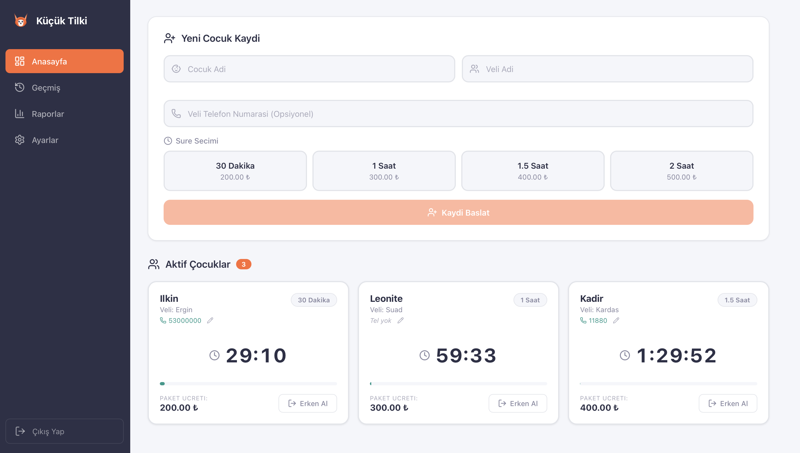
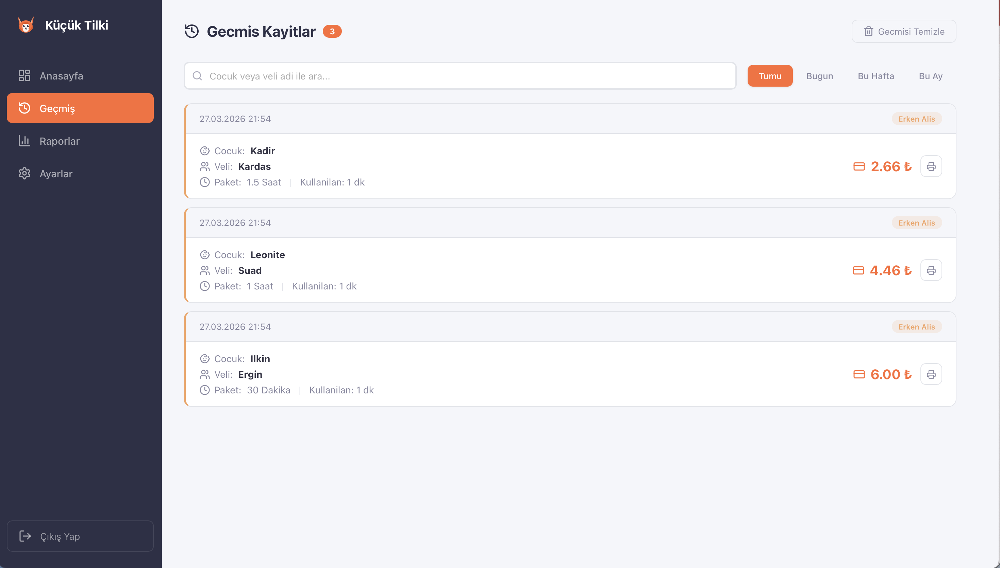
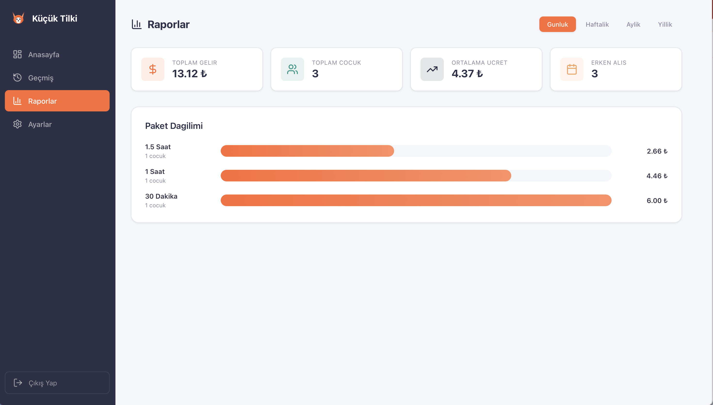

# Playcenter Dashboard

A full-featured management panel for children's entertainment centers. Built to handle child check-ins, time-based billing, overtime tracking, invoicing, and business analytics — all from a single dashboard.

> Currently in production use by a real business.

## Screenshots

| Login | Dashboard | History |
|-------|-----------|---------|
|  |  |  |

| Reports | Settings |
|---------|----------|
|  |  |

## Features

- **Child Registration** — Register children with parent info, phone number, and select a time-based package
- **Live Countdown Timers** — Real-time countdown for each active child with color-coded urgency indicators (normal, warning, critical, expired)
- **Overtime Billing** — Configurable tolerance period before overtime charges kick in, with per-minute billing at the package rate
- **Early Pickup** — Pro-rated pricing when a child is picked up before their package time expires
- **Session History** — Full history of all completed sessions with search, date filtering, and print/PDF invoicing
- **Business Reports** — Revenue analytics with daily, weekly, monthly, and yearly breakdowns plus package distribution charts
- **Invoice Generation** — Print-ready invoices with share functionality
- **Audio & Tab Alerts** — Sound alerts and browser tab flashing when a child's time expires
- **Backup & Restore** — Export/import all data as JSON
- **Configurable Packages** — Add, edit, or remove time/price packages from the settings panel
- **Password Protected** — Admin login with changeable credentials
- **Cloud Database** — All data persisted in Supabase, accessible from any device

## Tech Stack

- **Frontend:** React 19 + Vite
- **Database:** Supabase (PostgreSQL)
- **Routing:** React Router v7
- **Icons:** Lucide React
- **Hosting:** Netlify
- **State:** React hooks + Context API

## Getting Started

### Prerequisites

- Node.js 18+
- A [Supabase](https://supabase.com) project

### Installation

```bash
git clone https://github.com/ilkinkala/playcenter-dashboard.git
cd playcenter-dashboard
npm install
```

### Environment Variables

Create a `.env` file in the root directory:

```env
VITE_SUPABASE_URL=your_supabase_project_url
VITE_SUPABASE_ANON_KEY=your_supabase_anon_key
```

### Database Setup

Create these tables in your Supabase SQL Editor:

```sql
CREATE TABLE admin (
  id uuid DEFAULT gen_random_uuid() PRIMARY KEY,
  username text NOT NULL,
  password text NOT NULL
);

CREATE TABLE settings (
  id uuid DEFAULT gen_random_uuid() PRIMARY KEY,
  packages jsonb NOT NULL,
  tolerance_minutes integer NOT NULL DEFAULT 5
);

CREATE TABLE active_children (
  id text PRIMARY KEY,
  child_name text NOT NULL,
  parent_name text NOT NULL,
  parent_phone text DEFAULT '',
  package_label text NOT NULL,
  package_minutes integer NOT NULL,
  package_price numeric NOT NULL,
  start_time bigint NOT NULL,
  end_time bigint NOT NULL
);

CREATE TABLE history (
  id text PRIMARY KEY,
  child_name text NOT NULL,
  parent_name text NOT NULL,
  parent_phone text DEFAULT '',
  package_label text NOT NULL,
  package_minutes integer NOT NULL,
  package_price numeric NOT NULL,
  start_time bigint NOT NULL,
  end_time bigint NOT NULL,
  used_minutes numeric NOT NULL,
  type text NOT NULL,
  overtime_minutes numeric DEFAULT 0,
  overtime_price numeric DEFAULT 0,
  final_price numeric NOT NULL,
  completed_at timestamptz NOT NULL DEFAULT now()
);
```

Enable RLS with policies:

```sql
ALTER TABLE admin ENABLE ROW LEVEL SECURITY;
CREATE POLICY "Allow all" ON admin FOR ALL USING (true) WITH CHECK (true);
ALTER TABLE settings ENABLE ROW LEVEL SECURITY;
CREATE POLICY "Allow all" ON settings FOR ALL USING (true) WITH CHECK (true);
ALTER TABLE active_children ENABLE ROW LEVEL SECURITY;
CREATE POLICY "Allow all" ON active_children FOR ALL USING (true) WITH CHECK (true);
ALTER TABLE history ENABLE ROW LEVEL SECURITY;
CREATE POLICY "Allow all" ON history FOR ALL USING (true) WITH CHECK (true);
```

Insert a default admin user and configure your packages from the Settings page after first login.

### Run

```bash
npm run dev
```

## Project Structure

```
src/
  components/       # Reusable UI components
    AddChildForm    # Child registration form
    TimerCard       # Live countdown timer card
    AlertOverlay    # Time-up alert with sound
    CompletionModal # Receipt/invoice modal
    Sidebar         # Navigation sidebar
    FoxLogo         # SVG fox logo
  pages/            # Route pages
    DashboardPage   # Active children & timers
    HistoryPage     # Session history & search
    ReportsPage     # Revenue analytics
    SettingsPage    # Packages, tolerance, password, backup
    LoginPage       # Admin authentication
  context/
    AuthContext      # Session-based auth provider
  utils/
    storage         # Supabase CRUD operations
    pricing         # Price calculations
    sound           # Audio alert generation
    printInvoice    # HTML invoice generator
    tabNotification # Browser tab flashing
  lib/
    supabase        # Supabase client initialization
```

## License

MIT
